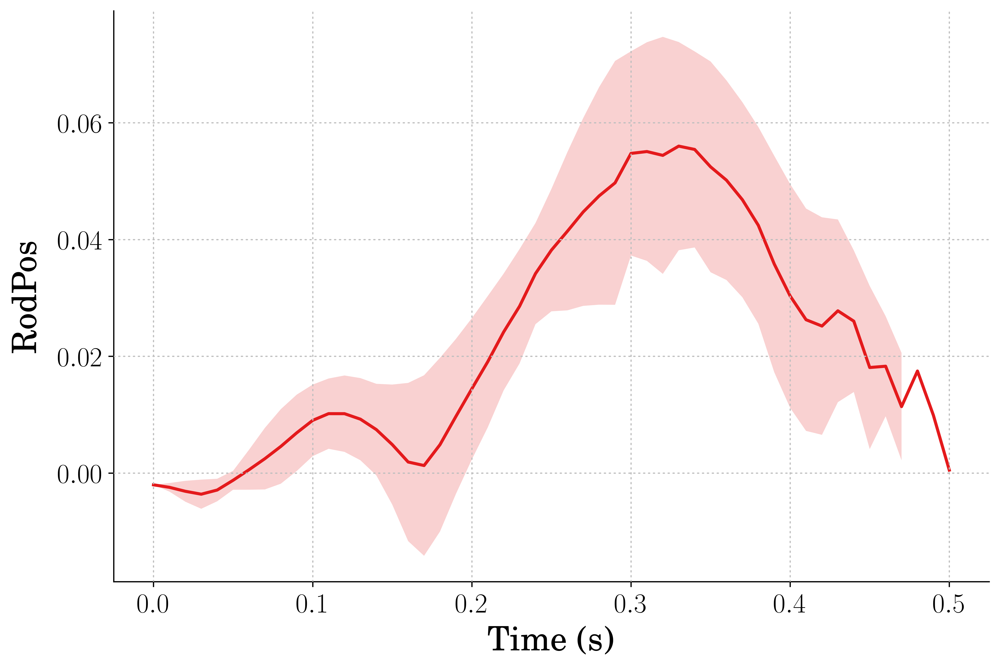

# Description of Training Data - 2022/01/18
This is a short description of the training data that is within this repository. It is meant to act as a history marker for tracking testing of different training parameters including things like hyperparameter selection.

## Training
Agents were trained according to the `training.py` script in the repository. They were trained with a randomly placed actuator position and static spring constant and damping ration value. See table for parameters.

| Spring Constant Range |  Zeta Range | Actuator Position |
|:---------------------:| :----------:|-------------------|
|     2038 to 7030      | 0.0 to 0.01 | 0 : Max Act Pos   |

## Evaluation
Agents were evaluated on **three** sets of environment parameters with the actuator position starting at mid-stroke. See table for parameters. The data for the performance is within `/figures_data/` and `/figures` folders.

|  Spring Constants | Zetas | Actuator Position |
|:-----------------:|:-----:|-------------------|
|  3760, 5760, 7760 |  0.01 | 0.5*(Max Act Pos) |

## File Naming Convention

The naming convention within the `/figures_data/` is as follows: 
`/xxx_yyy/`
- `xxx` = spring constant tested
- `yyy` = damping ratio tested

The naming convention within the `/xxx_yyy/` is as follows:
`aaa_bbb_ccc_ddd_eee_fff.csv`
- `aaa` = Step during training the agent was generated
- `bbb` = Type of agent that was evaluated
  - Effic = Efficient Agent
  - Heigh = Height Agent
  - SpecH = Specified Height Agent
  - SpHiEf = Specified Height Efficiently Agent
- `ccc` = Type of jump the agent was trained to accomplish
- `ddd` = The network initialization seed
- `eee` = Date stamp on data
- `fff` = Time stamp on data

Additionally there is a `/Combined_Data` folder within `/xxx_yyy/`. This is simply a compilation of all the data within the `/xxx_yyy/` folder which may make plotting averages and standard deviations easier. 

## Data at A Glance
### Spring Constant: 3760
#### Height Agent

     
    <strong>System Input</strong>

     
    <strong>Pogo Height</strong>

#### Efficient Agent

     
    <strong>System Input</strong>

     
    <strong>Pogo Height</strong>

#### Specified Height Agent

     
    <strong>System Input</strong>

     
    <strong>Pogo Height</strong>

### Spring Constant: 5760
#### Height Agent

     
    <strong>System Input</strong>

     
    <strong>Pogo Height</strong>

#### Efficient Agent

     
    <strong>System Input</strong>

     
    <strong>Pogo Height</strong>

#### Specified Height Agent

     
    <strong>System Input</strong>

     
    <strong>Pogo Height</strong>

### Spring Constant: 7760
#### Height Agent

     
    <strong>System Input</strong>

     
    <strong>Pogo Height</strong>

#### Efficient Agent

     
    <strong>System Input</strong>

     
    <strong>Pogo Height</strong>

#### Specified Height Agent

     
    <strong>System Input</strong>

     
    <strong>Pogo Height</strong>

